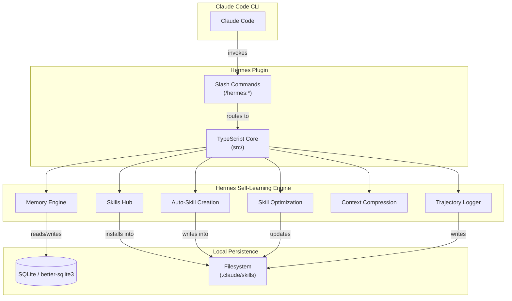

<!--
  Hermes Plugin for Claude Code — Public Project README
  Purpose: Primary entrypoint for GitHub visitors and potential contributors.
  Last updated: 2026-04-15
-->

<div align="center">

# Hermes Plugin for Claude Code

<p>
  <em>Embed the full Hermes self-learning engine into Claude Code — across Linux, macOS, and Windows 11.</em>
</p>

<p>
  <a href="https://github.com/galixiaomaohan/claude-code-hermes-plugin">
    
  </a>
  <a href="https://github.com/galixiaomaohan/claude-code-hermes-plugin">
    
  </a>
  <a href="https://github.com/galixiaomaohan/claude-code-hermes-plugin">
    
  </a>
  <a href="https://github.com/galixiaomaohan/claude-code-hermes-plugin">
    = 18" />
  </a>
  <a href="./LICENSE">
    
  </a>
</p>

</div>

---

> **Platform Compatibility Notice**
>
> The Linux and Windows 11 distributions have been validated in real environments. The macOS distribution is structurally aligned with the other platforms but has **not been tested on actual Mac hardware** due to lack of access. Users installing on macOS should proceed with the understanding that on-device behavior is unverified.

---

## Table of Contents

- [What & Why](#what--why)
- [Architecture Overview](#architecture-overview)
- [Quickstart](#quickstart)
- [Directory Structure](#directory-structure)
- [Features](#features)
- [Command Reference](#command-reference)
- [System Requirements](#system-requirements)
- [Contributing & Legal](#contributing--legal)
- [Acknowledgments](#acknowledgments)

---

## What & Why

**Hermes Plugin** is a native Claude Code plugin that embeds the complete Hermes self-learning stack — Skills Hub, Auto-Skill Creation, Skill Optimization, Memory Search, Context Compression, Trajectory Logging, and real-time Status monitoring — directly into your local Claude Code CLI workflow.

All self-learning capabilities are derived from the upstream **[hermes-agent](https://github.com/galixiaomaohan/claude-code-hermes-plugin)** project.

It solves the cross-platform deployment gap: instead of manually configuring Hermes modules for every OS, you download the pre-structured distribution for your platform, run `node install.js`, and restart Claude Code. Everything is wired, built, and ready.

---

## Architecture Overview



---

## Quickstart

### For End Users

1. **Pick your platform directory**:
   - Linux &rarr; `hermes_plugin_linux/`
   - macOS &rarr; `hermes_plugin_macos/`
   - Windows 11 &rarr; `hermes_plugin_win11/`

2. **Install**:

```bash
cd hermes_plugin_linux
node install.js
```

3. **Restart Claude Code** and verify:

```
/plugin
```

You should see `hermes-plugin @ local` in the **Installed** tab.

### For Developers

```bash
# Clone
git clone https://github.com/galixiaomaohan/claude-code-hermes-plugin.git
cd claude-code-hermes-plugin/hermes_plugin_linux

# Install dependencies
npm install

# Type-check and build
npm run typecheck
npm run build

# Install into Claude Code
npm run install:plugin
```

---

## Directory Structure

This repository ships three structurally identical, platform-tuned distributions:

| Directory | Target Platform | Validation Status |
|-----------|-----------------|-------------------|
| `hermes_plugin_linux/` | Linux / Ubuntu / Debian / CentOS / WSL | Validated on Node.js 18+ with `npm` and `bun` |
| `hermes_plugin_macos/` | macOS (Intel & Apple Silicon) | Structurally aligned; **not validated on actual macOS hardware** |
| `hermes_plugin_win11/` | Windows 11 | PowerShell-compatible install scripts; validated |

Each directory contains:

```
hermes_plugin_<platform>/
├── .claude-plugin/
│   └── plugin.json           # Plugin manifest
├── commands/                 # Slash command definitions
├── hooks/
│   └── hooks.json            # Lifecycle hooks
├── src/                      # TypeScript source
│   ├── cli.ts
│   ├── index.ts
│   ├── commands/
│   ├── modules/              # Hermes core modules
│   ├── utils/
│   └── types.ts
├── tests/                    # Test suites
├── dist/                     # Compiled JavaScript
├── install.js                # One-click installer
├── uninstall.js              # Clean uninstaller
├── package.json
└── tsconfig.json
```

---

## Features

| Feature | Command | Description |
|---------|---------|-------------|
| **Skills Hub** | `/hermes:skills-hub` | Browse, search, and install skills from the Hermes Skills Hub without leaving Claude Code. |
| **Auto-Skill Creation** | `/hermes:create-skill` | Turn a recent conversation into a reusable skill automatically. |
| **Skill Optimization** | `/hermes:optimize-skill` | Continuously improve existing skills based on real usage feedback. |
| **Multi-Provider Memory** | `/hermes:memory-search` | Search past sessions across built-in SQLite, mem0, or Honcho backends. |
| **Context Intelligence** | `/hermes:compress-context` | Compress long conversations while preserving tool-use context and key decisions. |
| **Training Bridge** | `/hermes:log-trajectory` | Log conversation trajectories to the Hermes training bridge for future model improvement. |
| **Runtime Status** | `/hermes:status` | Inspect the live state of every Hermes module in one command. |
| **Safe Uninstall** | `node uninstall.js` | Removes all plugin artifacts, marketplace entries, and local data cleanly. |

---

## Command Reference

| Command | Purpose |
|---------|---------|
| `npm run typecheck` | Run TypeScript compiler in no-emit mode to validate types. |
| `npm run build` | Compile `src/` into `dist/` using `tsc`. |
| `npm run test` | Execute the Node.js test runner against `dist/tests/*.js`. |
| `npm run install:plugin` | Run `install.js` to register the plugin with Claude Code CLI. |
| `npm run uninstall:plugin` | Run `uninstall.js` to remove the plugin and clean up artifacts. |
| `npm run dev` | Execute the compiled CLI directly (`node dist/src/cli.js`). |

---

## System Requirements

- **Node.js** >= 18.0.0
- **Claude Code CLI** (`claude`) available in your system `PATH`
- **Package manager**: `npm` (recommended), or `bun`, `pnpm`, `yarn`

---

## Contributing & Legal

- [Contributing Guidelines](./doc/CONTRIBUTING.md)
- [Disclaimer & Liability Limitations](./doc/DISCLAIMER.md)
- [GitHub Publish Guide](./doc/GITHUB_PUBLISH_GUIDE.md)
- [MIT License](./LICENSE)

---

## Acknowledgments

Hermes Plugin is built for and on top of [Claude Code](https://claude.ai/code) by Anthropic. The self-learning capabilities are derived from the upstream **hermes-agent** project. We thank the Anthropic team and the Hermes community for the platform and ideas that make this plugin possible.
